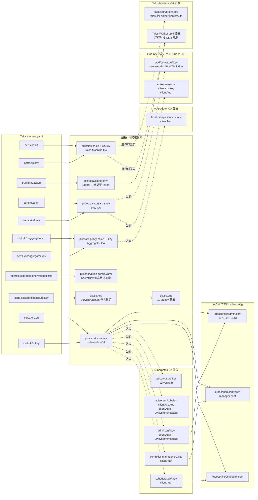
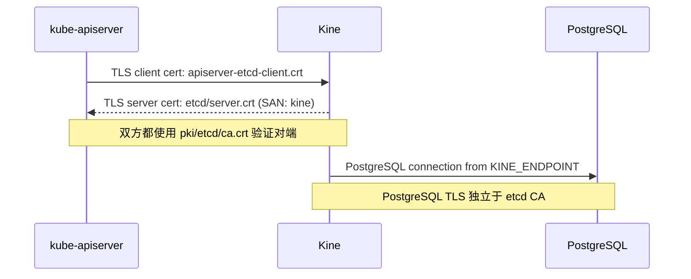

# Talos secrets 到 Kubernetes PKI 的映射

图中的实线表示直接引用或解码写出，虚线表示使用 CA 签发新证书。
所有源字段都来自 `secrets.yaml`，图中只展示字段名，不展示字段内容。

## 字段和用途

| `secrets.yaml` 源字段 | 输出或派生内容 | 使用者 |
|---|---|---|
| `certs.k8s.crt`、`certs.k8s.key` | Kubernetes CA；签发 API Server、控制器、调度器和管理员证书 | kube-apiserver、controller-manager、scheduler、kubectl |
| `certs.k8saggregator.crt`、`certs.k8saggregator.key` | front-proxy CA；签发 `front-proxy-client` | kube-apiserver aggregation layer |
| `certs.etcd.crt`、`certs.etcd.key` | etcd CA；签发 Kine server 和 API Server client 证书 | Kine 与 kube-apiserver 之间的 mTLS |
| `certs.k8sserviceaccount.key` | 直接写成 `sa.key`，并导出 `sa.pub` | API Server 验证、controller-manager 签发 ServiceAccount token |
| `secrets.secretboxencryptionsecret` | 写入 `encryption-config.yaml` 的 SecretBox provider | kube-apiserver 加密存入 Kine/PostgreSQL 的 Kubernetes Secret |
| `certs.os.crt`、`certs.os.key` | Talos Machine CA；签发 signer 服务端证书及 Worker apid 证书 | talos-csr-signer、Talos Worker |
| `trustdinfo.token` | 写入私有 `signer.env` | Worker 请求 Talos Machine 证书时的共享认证 |

## 当前没有使用的 Talos 字段

下面这些材料属于 Talos OS、节点信任或 bootstrap 流程，不参与这个 Docker
Compose Kubernetes 控制平面：

- `cluster.id`、`cluster.secret`
- `secrets.bootstraptoken`

## mTLS 数据流

